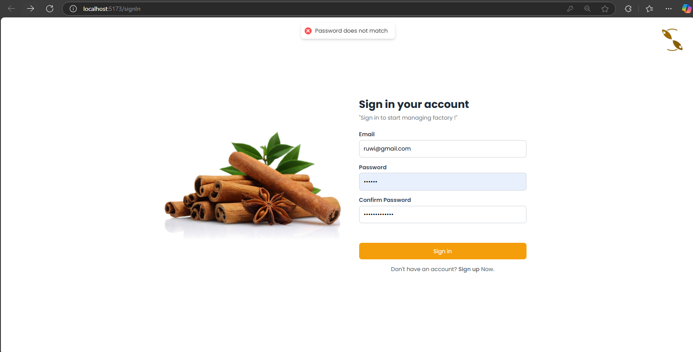
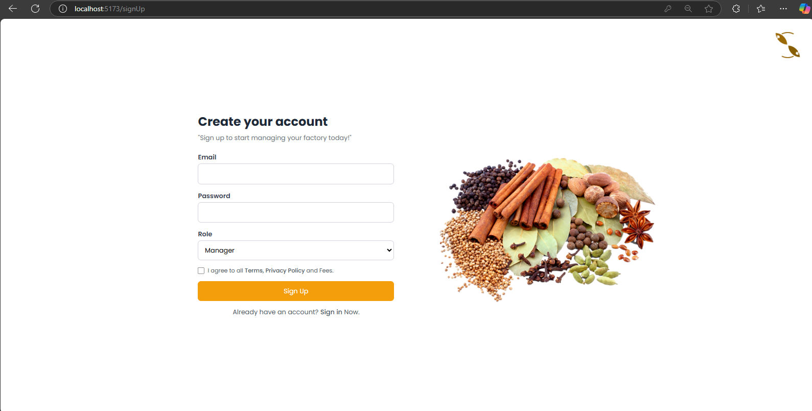
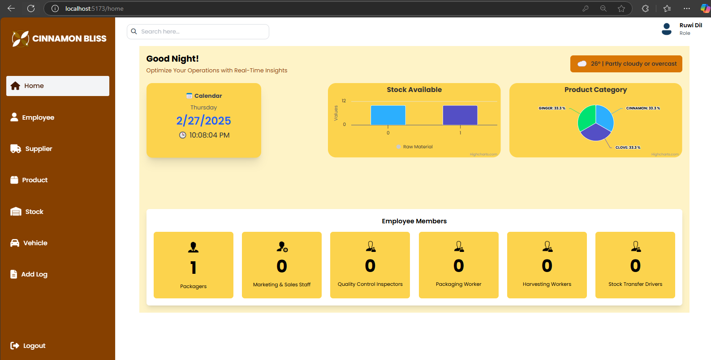
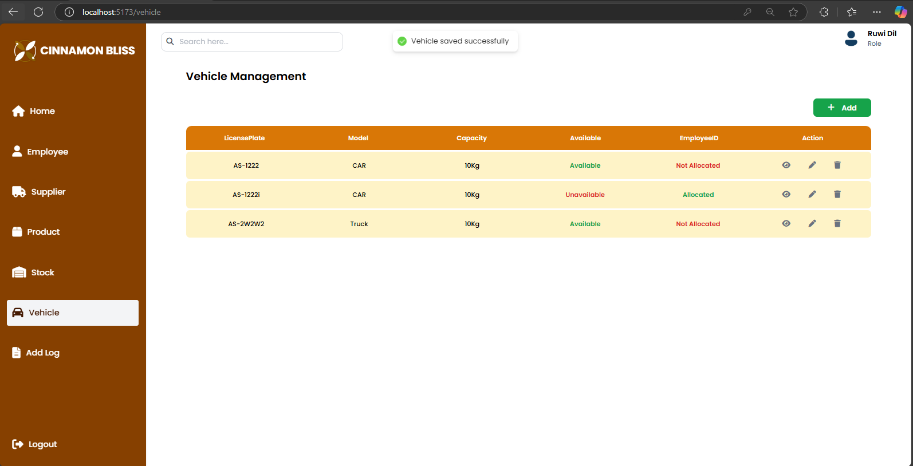
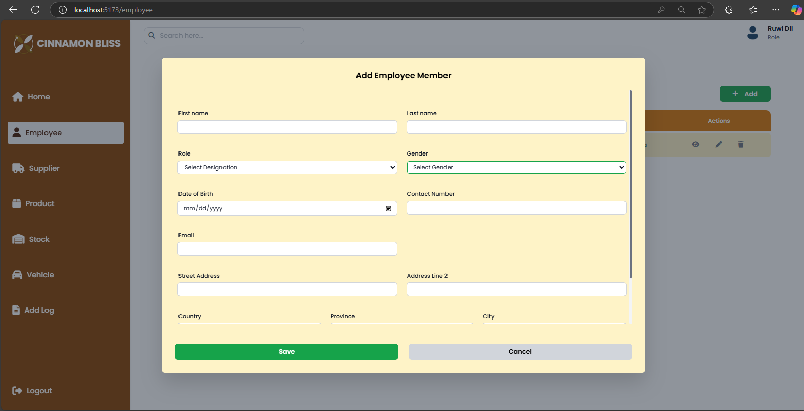
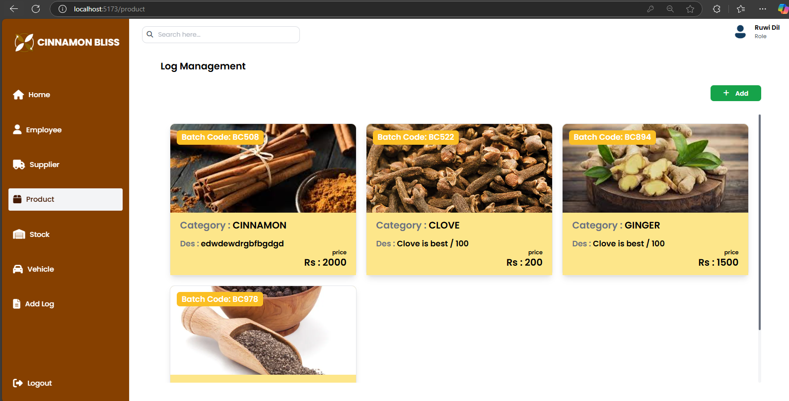
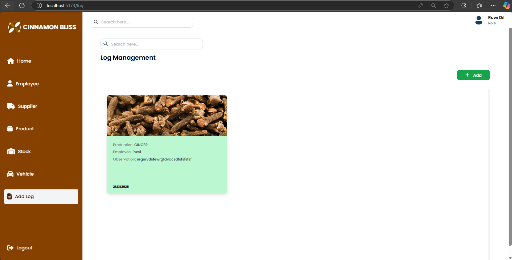
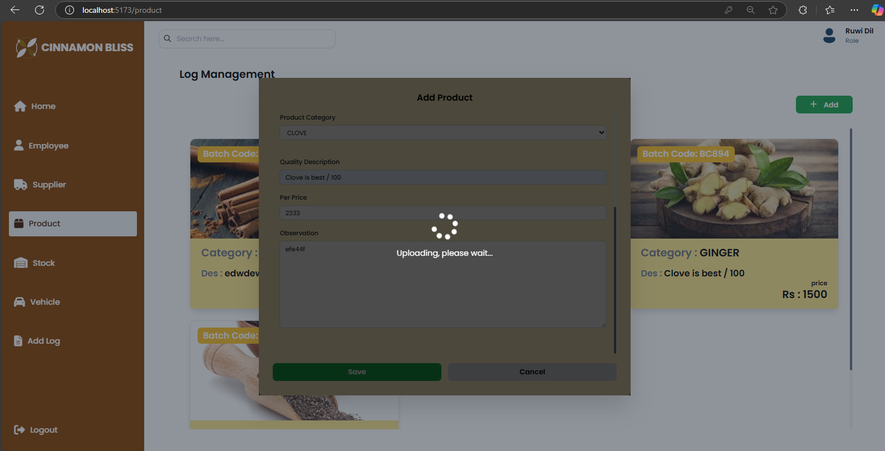

# Cinnamon Bliss - Frontend
[Demo Link](https://media-hosting.imagekit.io//5749252f6ae14a08/frontend%20vedio.mp4?Expires=1836461529&Key-Pair-Id=K2ZIVPTIP2VGHC&Signature=qBLu69Vt7Ka5rcW7EyRxRsuQ5aZNn-gFr~q3ic7sNBf3rc207Fm1MFNYsWpne52lW50J6MEuedsRZcLo9SsekbWBC8k4lZrRnuXeMvdtZS6HHzzk~0hFXF8uzIClFH06bX-WHOuMLNOGVzo3jrrqqHxDNGQQV~zuuz8m-ns0L38e0oz4YU~fdOCdlutA6SZlnoJTeRcVxjgFybEnJmTme3e---5aLhsuQj4H43MfkGS2u2kx8WHo3C9Pr4wozHfRRVM9NsUItoT7IUMT3BgCIDbEtbAeK85DeKM0p0ytTHcdzr8TyR-~W8bGyPolEZdUUAUOHskwEVKqOJghMPfHEw__)

Cinnamon Bliss Management System is a web application built with React, Redux, Express, and Node.js. This system manages tea craft operations efficiently, providing a seamless user experience with a modern UI and optimized API handling. Prisma ORM, and JWT authentication.

## 🚀 Features
- **React & Redux Toolkit**: Efficient state management using `Slice` and `store.ts`.
- **React Router (`react-router-dom`)**: Handles navigation with `<Navigate />` for redirection and `<Outlet />` for nested routes.
- **Toast Notifications**: Uses `react-toastify` for user-friendly message management.
- **Tailwind CSS**: Provides responsive and scalable styling.
- **Cloudinary**: Used for image storage and management.
- **Express & Node.js**: Backend API for handling requests.

## 🛠️ Tech Stack
### Frontend
- **React**
- **Redux Toolkit**
- **JSX**
- **Tailwind CSS**

### Backend
- **TypeScript (.ts files)** – A superset of JavaScript with static typing.
- **Node.js** – Server-side JavaScript runtime.
- **Express.js** – A lightweight web framework for handling HTTP requests.
- **Prisma ORM** – Used to interact with the database.
- **REST API** – Defines routes for managing RawMaterialStock and Employee entities.
- **Async/Await** – Used for handling asynchronous database operations.

This is a backend application built with **TypeScript + Express + Prisma** 🚀.

## 📌 Installation & Setup

### Prerequisites
- Node.js (>= 16.x)
- npm or yarn

### Clone the Repository Frontend
```bash
https://github.com/Sarankumar1812/CinnamonBliss-Frontend.git
```

### Clone the Repository Backend
```bash
https://github.com/Sarankumar1812/CinnamonBliss-Frontend.git
```


### Install Dependencies
```bash
npm install
# or
yarn install
```

### Start the Development Server
```bash
npm start
# or
yarn start
```
## viewUI
















## 🔧 API Integration
This project interacts with APIs using Redux `Slice` and `store.ts`. Ensure the backend server is running before making API calls.

## 📷 Image Handling
- Images are uploaded and managed via **Cloudinary**.
- Set up Cloudinary API credentials in your `.env` file.

## 🛤️ Navigation
- Uses `react-router-dom` for page transitions.
- `<Navigate />` handles redirection.
- `<Outlet />` is used for nested routes.

## 🎨 Styling
- Styled using **Tailwind CSS** for a modern and responsive UI.

## 💬 Notifications
- Uses `react-toastify` to manage user messages and alerts.

## 🤝 Contributing
Pull requests are welcome! Follow these steps:
1. Fork the repository.
2. Create a new branch (`feature-branch-name`).
3. Commit your changes.
4. Push to your fork and create a PR.

### 🔗 Postman documentation Links
https://documenter.getpostman.com/view/36641894/2sAYdfqrHE

---
### 🔗 Useful Links
- **Cloudinary**: [https://cloudinary.com/](https://cloudinary.com/)
- **React Redux**: [https://redux.js.org/](https://redux.js.org/)
- **Tailwind CSS**: [https://tailwindcss.com/](https://tailwindcss.com/)
- **React Router**: [https://reactrouter.com/](https://reactrouter.com/)
- **Prisma ORM**: [https://www.prisma.io/](https://www.prisma.io/)


# React + TypeScript + Vite

This template provides a minimal setup to get React working in Vite with HMR and some ESLint rules.

Currently, two official plugins are available:

- [@vitejs/plugin-react](https://github.com/vitejs/vite-plugin-react/blob/main/packages/plugin-react/README.md) uses [Babel](https://babeljs.io/) for Fast Refresh
- [@vitejs/plugin-react-swc](https://github.com/vitejs/vite-plugin-react-swc) uses [SWC](https://swc.rs/) for Fast Refresh

## Expanding the ESLint configuration

If you are developing a production application, we recommend updating the configuration to enable type aware lint rules:

- Configure the top-level `parserOptions` property like this:

```js
export default tseslint.config({
  languageOptions: {
    // other options...
    parserOptions: {
      project: ['./tsconfig.node.json', './tsconfig.app.json'],
      tsconfigRootDir: import.meta.dirname,
    },
  },
})
```

- Replace `tseslint.configs.recommended` to `tseslint.configs.recommendedTypeChecked` or `tseslint.configs.strictTypeChecked`
- Optionally add `...tseslint.configs.stylisticTypeChecked`
- Install [eslint-plugin-react](https://github.com/jsx-eslint/eslint-plugin-react) and update the config:

```js
// eslint.config.js
import react from 'eslint-plugin-react'

export default tseslint.config({
  // Set the react version
  settings: { react: { version: '18.3' } },
  plugins: {
    // Add the react plugin
    react,
  },
  rules: {
    // other rules...
    // Enable its recommended rules
    ...react.configs.recommended.rules,
    ...react.configs['jsx-runtime'].rules,
  },
})
```
